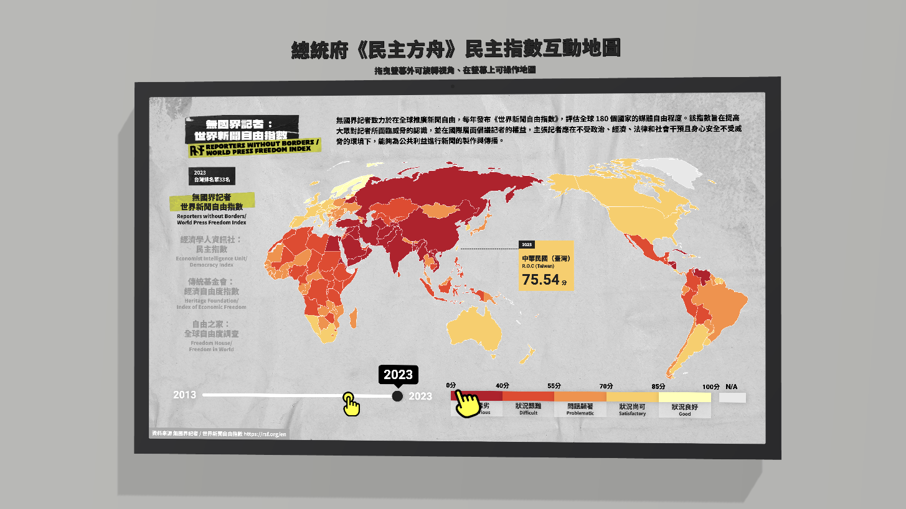
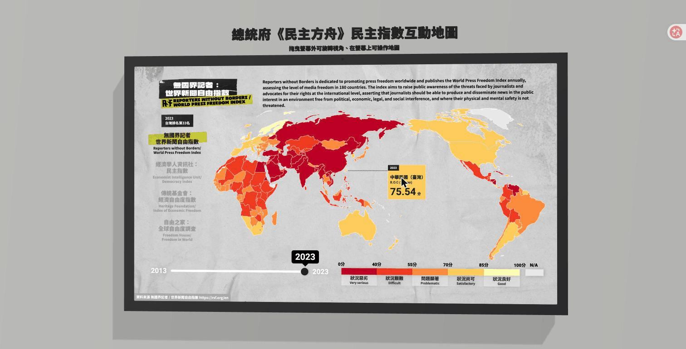
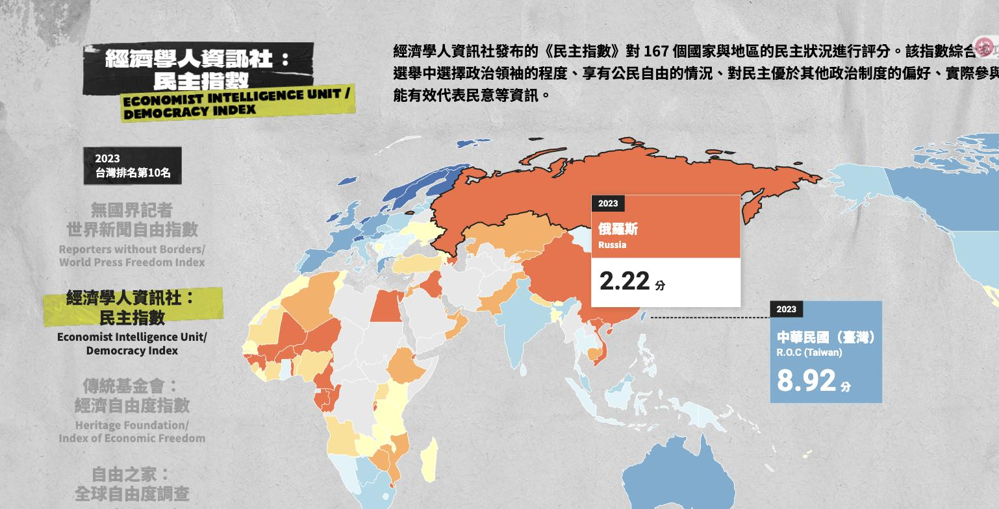
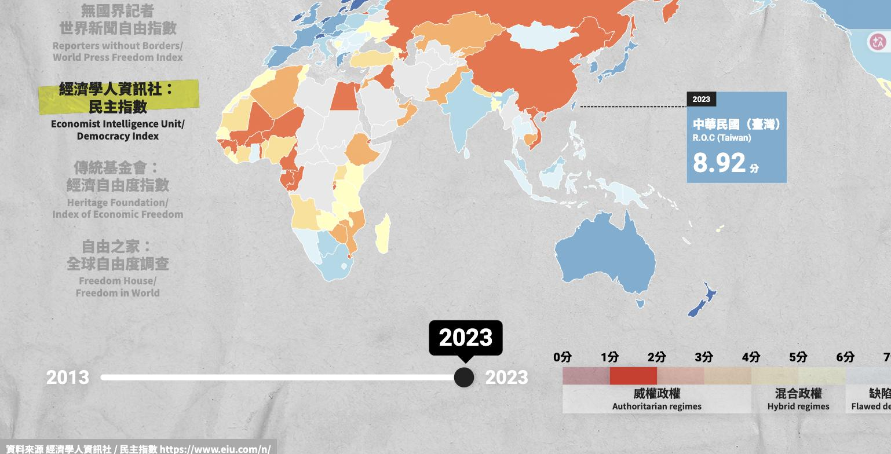

# 民主指數互動地圖

以台灣為視角出發的世界地圖互動裝置，整合四個國際研究機構的年度評比指數，讓觀眾用一張地圖看見台灣在世界上的相對位置。原始為總統府展場觸控螢幕設計，畫面尺寸固定1920×1080。

網站首頁是把這台觸控裝置放進3D展間的展示版（three.js、CSS3DRenderer + WebGL），螢幕本體直接是可操作的地圖，拖曳螢幕以外的地方可以轉視角：




## 功能

- **四組資料集切換**：經濟學人資訊社《民主指數》、無國界記者《世界新聞自由指數》、傳統基金會《經濟自由度指數》、自由之家《全球自由度調查》，共用同一套地圖、圖例、時間軸引擎
- **時間軸**：拖曳滑桿查看2013年至2023年各年度分數變化
- **圖例篩選**：點擊圖例色塊，以「focus + context」手法凸顯符合區間的國家，其餘國家降透明度但保留地理脈絡
- **台灣資訊卡**：常駐顯示台灣當年度分數與排名，不用在地圖上自己找
- **中英雙語輪播**：每30秒切換一次指數說明文字
- **觸控展場情境設計**：待機引導手勢動畫、防止手勢與雙擊縮放、禁用右鍵選單、隱藏開發者全螢幕模式（連點左上角10次）

| 點擊國家看即時分數 | 圖例篩選（focus + context） |
| --- | --- |
|  |  |

## 技術

- 原生JavaScript（ES Modules）+ [D3.js](https://d3js.org/)（地理投影、資料綁定、互動）+ [TopoJSON](https://github.com/topojson/topojson)
- [Vite](https://vitejs.dev/)開發環境
- 無框架、無建置時期的UI library，單純用DOM與SVG操作

## 專案結構

```
src/
  app.js                    主邏輯：資料載入、地圖上色、互動事件
  setting.js                展場觸控裝置行為（待機動畫、防縮放、全螢幕）
  modules/
    datasets.js             四組指數的色階、級距、文案設定
    createMap.js            地圖SVG繪製
    createLegend.js         圖例繪製
    createSlider.js         年份滑桿繪製
  data/                     四組指數的年度分數（JSON）
  world_info.tsv            Natural Earth國家屬性表
  world_map.json            世界地圖TopoJSON
  countryChineseName.json   英文國名對中文名稱對照表
```

## 本機執行

```sh
npm install
npm run dev
```

## 資料來源與版權

地圖與國家資訊採用[Natural Earth](https://www.naturalearthdata.com/)（公眾領域）。四組指數資料分別引用自：

- 經濟學人資訊社（EIU）《民主指數》──https://www.eiu.com/n/
- 無國界記者（RSF）《世界新聞自由指數》──https://rsf.org/en
- 傳統基金會（Heritage Foundation）《經濟自由度指數》──https://www.heritage.org/index/
- 自由之家（Freedom House）《全球自由度調查》──https://freedomhouse.org/zh-hant

各資料版權屬原機構所有，此專案僅作非商業性的資料視覺化與教育展示用途。
